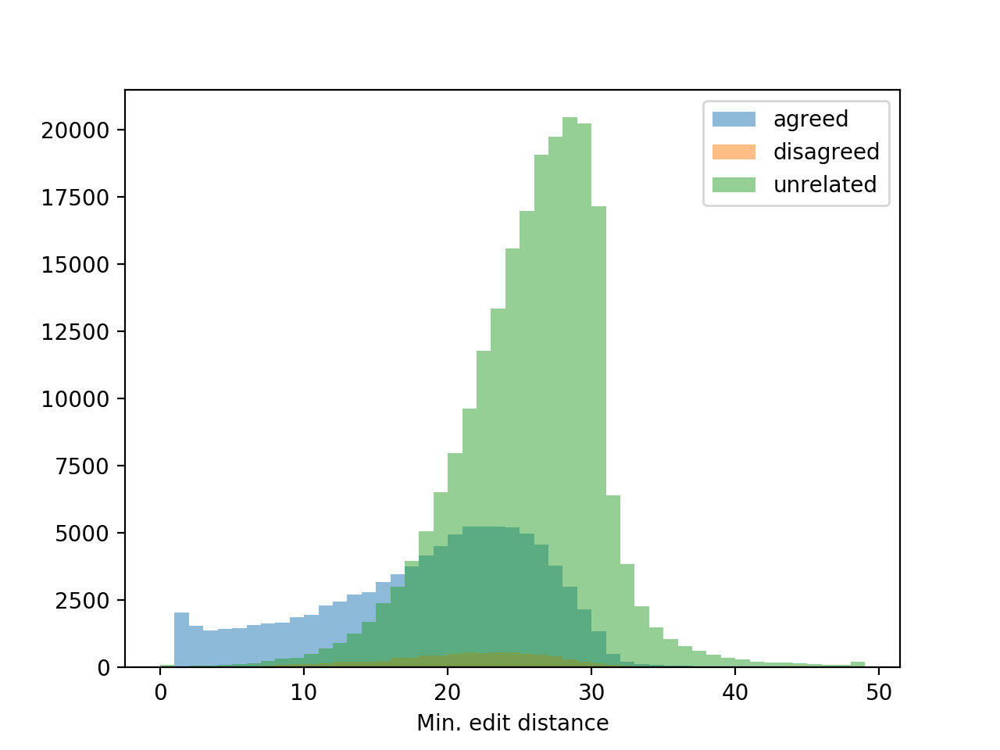

# Project 1 - Fake News Detection

## Description

Classification of news article

Given the title of a fake news article A and the title of a coming news article B, students are asked to classify B into one of the three categories.

* agreed: B talks about the same fake news as A
* disagreed: B refutes the fake news in A
* unrelated: B is unrelated to A

## Data

Example:

```
A: 用大蒜鉴别地沟油的方法,怎么鉴别地沟油
B: 吃了30年食用油才知道，一片大蒜轻松鉴别地沟油
Agreed
A: "飞机就要起飞，一个男人在机舱口跪下！"这是最催泪的一幕	
B:「网警辟谣」飞机起飞前男人机舱口跪下？这故事居然是编的！
Disagreed
A: 吃榴莲的禁忌,吃错会致命!
B: 榴莲不能和什么一起吃 与咖啡同吃诱发心脏病
Unrelated
```

## Methodology

### Similarity

#### Minimum Edit Distance

Class | nobs | minmax | mean | median | variance | skewness | kurtosis
--- | --- | --- | --- | --- | --- | --- | ---
agreed | 92973 | (0, 95) | 18.26826 | 20 | 59.14989 | -0.41811 | -0.06337
disagreed | 8266 | (0, 146) | 20.77824 | 21 | 42.81264 | 1.09152 | 19.70800
unrelated | 219313 | (0, 150) | 25.34657 | 26 | 32.43219 | 1.59705 | 27.60223

Histogram



### Classification

## Evaluation

**Weighted accuracy**: The weights of the three categories, agreed, disagreed and unrelated are **1/15**, **1/5**, **1/16**, respectively.